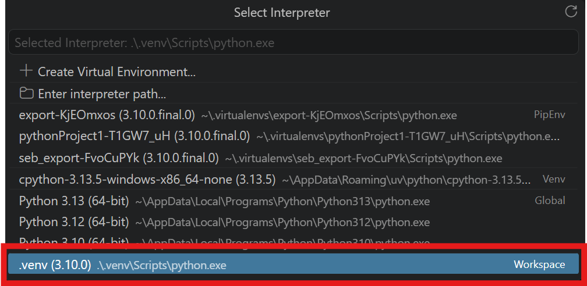

# Projektarbeit 2026

## Voraussetzungen

- Python 3.10.00
- aktuelle pip version
- Vs Code
- windows powershell

## Installationsguide:


laying the foundation for installment:
```powershell
git clone git@github.com:fidi00002/projektarbeit-2026.git

cd projektarbeit-2026

py -3.10 -m venv .venv
 
.\.venv\Scripts\Activate.ps1
```

(Falls Powershell die Ausführung des Skripts blockieren sollte, kann mittels:
```powershell
Set-ExecutionPolicy -Scope Process -ExecutionPolicy Bypass
```
einmalig umgangen werden)

Für die dauerhafte Nutzung empfehle ich jedoch folgenden Befehl:
```powershell
Set-ExecutionPolicy -Scope CurrentUser -ExecutionPolicy RemoteSigned
```
dieser sorgt dafür dass lokale Skripte wie .venv dauerhaft auf dem Benutzer uneingeschränkt ausgeführt werden können


mit 
```powershell
 python --version
 ``` 
 überprüfen ob 
 ```powershell 
 Python 3.10.0
 ``` 
 als aktuelle Python Version gegeben

dann mittels 
```powershell 
python -m pip install -r requirements.txt
``` 
alle benötigten Bibliotheken installieren

danach zusätzlich einmal die passenden import dateien für die `nltk` library runterladen:
```powershell
python -m nltk.downloader stopwords
```

Lastly regarding the setup you should definitely select the corresponding interpreter by hitting STRG + P + SHIFT > Python: Select Interpreter and choosing the one which includes `.venv` like this:



Das Hauptprogramm kann mit 
```powershell 
python main.py
```
gestartet werden
(oder einfach über den Play Button, falls VS Code benutzt wird)

Nach Abschluss, kann die virtuelle Umgebung mittels 
```powershell 
deactivate
```
verlassen werden

## Ganz wichtig 

In die leeren client = OpenAI(api_key="Platzhalter") Anweisungen, muss anstatt des Platzhalters jeweils der API-Key gesetzt werden

Datensatz

Dieses Projekt verwendet das Contract Understanding Atticus Dataset (CUAD) des Atticus Project.

CUAD ist unter der Creative Commons Attribution 4.0 License (CC BY 4.0) veröffentlicht.

Quelle: https://huggingface.co/datasets/theatticusproject/cuad

Die im Ordner `original_contracts/` enthaltenen Testverträge stammen aus dem CUAD-Datensatz und dienen zum Testen der Anwendung.


